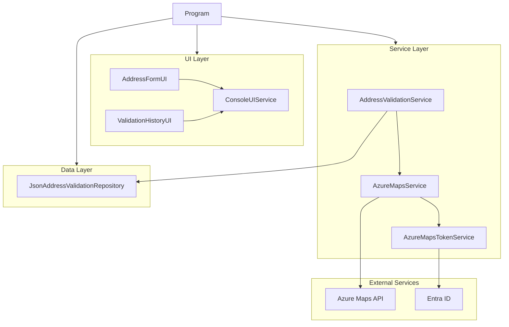
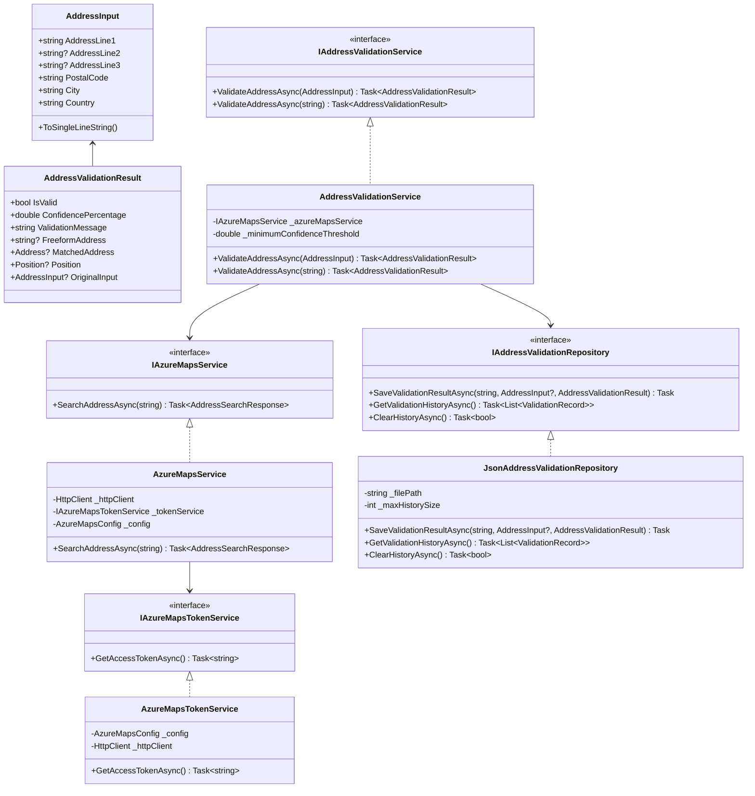
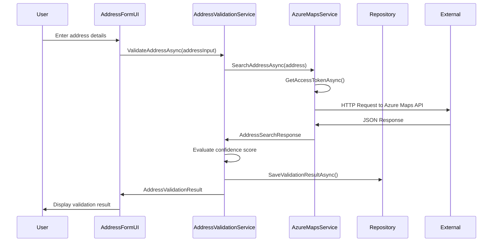
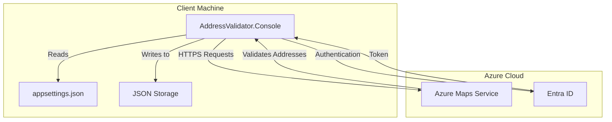
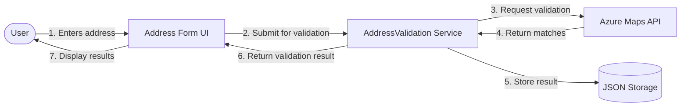
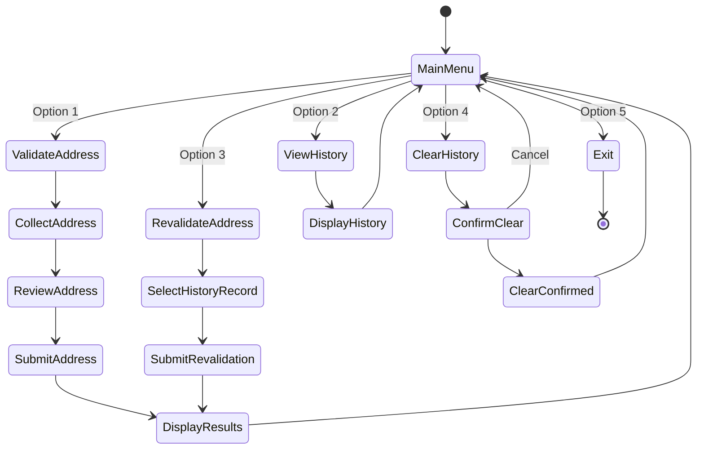

# AddressValidator Architecture Diagrams (Mermaid)

GitHub natively renders these Mermaid diagrams when included in markdown files. Simply include them in your README.md or documentation files.

## 1. Component Architecture



## 2. Class Diagram



## 3. Sequence Diagram - Address Validation



## 4. Infrastructure Diagram



## 5. Data Flow Diagram



## 6. Main Menu Navigation Flow



## How to Use in GitHub Markdown

Simply copy and paste these code blocks (including the triple backticks and "mermaid") into your GitHub markdown files. GitHub will automatically render them as diagrams.

Example usage in README.md:

````markdown
## Application Architecture

