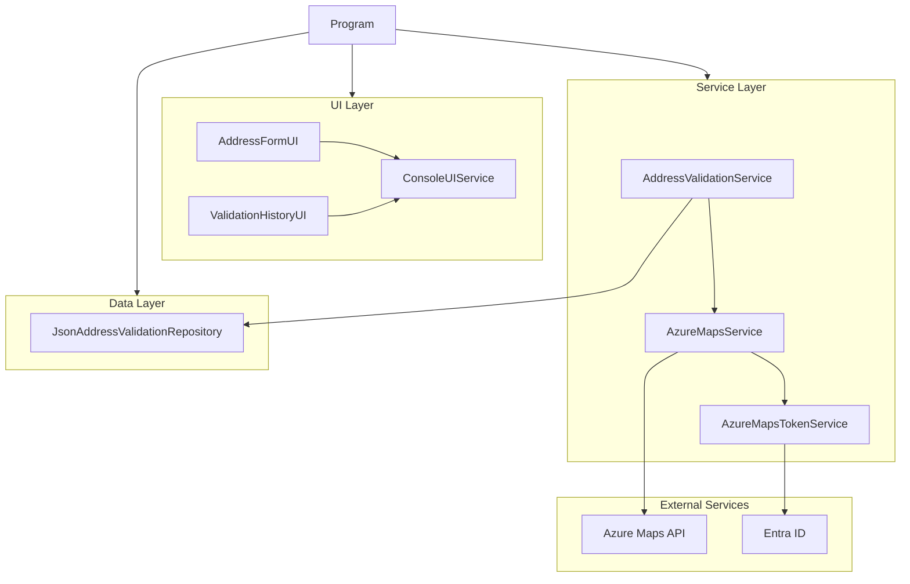
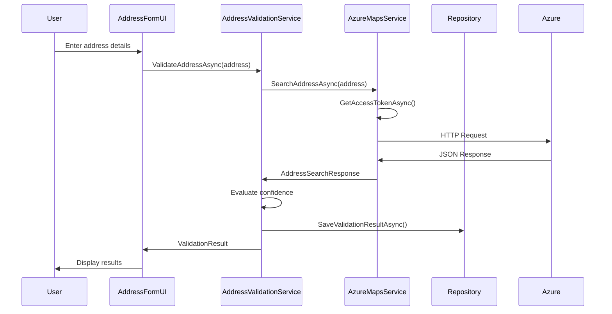

## Architecture Overview

AddressValidator follows a clean, layered architecture designed for maintainability and testability:

### Address Validation Process

### Key Architecture Principles

- **Clean Layering**: UI, services, and data access are clearly separated
- **Dependency Injection**: All services are registered with the DI container
- **Interface-Based Design**: Components depend on abstractions, not implementations
- **Single Responsibility**: Each class has a focused purpose and clear responsibilities
- **Comprehensive Error Handling**: Structured exception handling throughout all layers

For complete architecture documentation with additional diagrams, see [Mermaid Architecture Diagrams](Mermaid-Architecture-Diagrams.md).