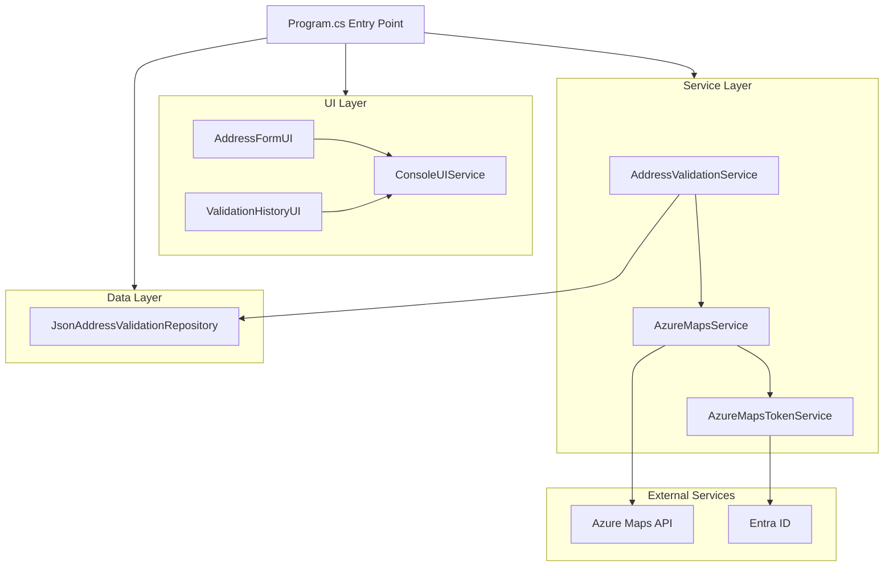

# AddressValidator

[](https://dotnet.microsoft.com/download)
[](https://docs.microsoft.com/en-us/dotnet/csharp/)
[](https://azure.microsoft.com/en-us/)
[](https://learn.microsoft.com/en-us/dotnet/architecture/modern-web-apps-azure/common-web-application-architectures)
[](https://xunit.net/)
[](https://github.com/features/actions)

AddressValidator is a .NET console application for address validation using Azure Maps and Entra ID authentication. Developed as part of client solutions at Digital David AG, it features a modular architecture with clean separation between UI, service, and data layers. While primarily a demonstration tool, its well-designed components could be adapted for integration into larger systems.

<div align="center">


*Quick demonstration of the address validation workflow*
</div>

## Table of Contents

- [Overview](#overview)
- [Features](#features)
- [Getting Started](#getting-started)
  - [Prerequisites](#prerequisites)
  - [Configuration](#configuration)
  - [Running the Application](#running-the-application)
- [Testing](#testing)
- [Project Structure](#project-structure)
- [Architecture](#architecture)
- [Technologies](#technologies)
- [Development Process](#development-process)
- [License](#license)
- [Project Goals](#project-goals)

## Overview

AddressValidator helps you determine the validity and accuracy of addresses by leveraging the Azure Maps API. The application:

- Verifies if addresses exist according to Azure Maps
- Provides confidence level metrics for matches
- Returns detailed address information including coordinates
- Stores both input addresses and API responses for future reference

## Features

### Address Validation

- Validates addresses against Azure Maps API
- Configurable confidence threshold (currently 80%)
- Detailed validation results including coordinates and formatted addresses

### Enhanced User Interface

- Rich, colorful console UI powered by Spectre.Console
- Intuitive navigation with clear menus and prompts
- Interactive address form with field validation
- Address review screen with editable fields
- **Bold formatting for user input** for better visibility
- Comprehensive error handling with user-friendly messages

### Storage and History

- Persistent storage of validation results
- View validation history with chronological ordering
- Re-validate addresses from history
- Clear history when needed
- Sample data included for testing

## Getting Started

### Prerequisites

- .NET 9.0 SDK
- Azure account with Maps service and Entra ID set up

### Configuration

The application uses appsettings.json for configuration. For security, this file is not included in source control.

1. Copy the example configuration:
```bash
cp AddressValidator.Console/appsettings.example.json AddressValidator.Console/appsettings.json
```

2. Edit appsettings.json with your Azure Maps credentials:
```json
{
  "AzureMaps": {
    "ClientId": "YOUR_CLIENT_ID_HERE",
    "Endpoint": "https://atlas.microsoft.com/"
  }
}
```

3. Replace `YOUR_CLIENT_ID_HERE` with your Azure Entra ID client ID.

> **Note:** Never commit appsettings.json to source control as it contains sensitive credentials.

### Running the Application

From the solution directory:
```bash
# Run from solution directory, specifying the project
dotnet run --project AddressValidator.Console/AddressValidator.Console.csproj

# OR navigate to the project directory and run
cd AddressValidator.Console
dotnet run
```

## Testing

The application includes a comprehensive test suite covering all aspects of the system:

```bash
# Run all tests from solution directory
dotnet test

# Run tests with filter
dotnet test --filter "FullyQualifiedName~EdgeCases"
dotnet test --filter "Category!=AzureIntegration"
```

## Project Structure

The codebase is organized into clean, modular components:

- **Models/**: Data models for the API responses and application
  - Address input/output structures
  - Validation results
  - Search response models
  
- **Services/**: Core application logic
  - Azure Maps API integration
  - Entra ID authentication
  - Address validation with confidence thresholds
  
- **Repositories/**: Data storage
  - JSON-based validation history storage
  
- **UI/**: User interface components
  - AddressFormUI: Input form with validation display
  - ValidationHistoryUI: History viewing and management
  - ConsoleUIService: Core UI services (spinners, errors)
  
- **Tests/**: Comprehensive test coverage
  - Unit tests (Models, Services, Repositories, UI)
  - Integration tests
  - Edge case testing

## Architecture

AddressValidator uses a clean, layered architecture with Azure Maps integration:



The application follows clean architecture principles with:
- UI components built with Spectre.Console for rich terminal experiences
- Service layer handling address validation logic and API integration
- Data layer managing validation history persistence
- External integration with Azure Maps secured via Entra ID

## Technologies

- **C# / .NET 9.0**: Modern development platform
- **Azure Maps Search API**: Address validation and geocoding
- **Entra ID**: Secure authentication
- **System.Text.Json**: Data serialization
- **Spectre.Console**: Enhanced terminal UI with colors and formatting
- **xUnit, Moq, FluentAssertions**: Testing tools
- **GitHub Actions**: CI/CD automation

## Development Process

This project uses GitHub Actions for continuous integration and deployment:

- Automated build and test on every push and pull request
- Comprehensive validation before merging changes
- Test result reporting

### Completed Milestones

- ✅ Azure Maps service integration with Entra ID authentication
- ✅ Data models and API response handling
- ✅ Address validation with confidence threshold
- ✅ Multiple potential address match handling
- ✅ Comprehensive test suite across all application layers
- ✅ GitHub Actions CI/CD pipeline
- ✅ JSON-based storage implementation
- ✅ Rich console UI with Spectre.Console
- ✅ Interactive address input form with validation
- ✅ Validation history management

## License

This project is licensed under the MIT License - see the [LICENSE](LICENSE) file for details.

## Project Goals

AddressValidator aims to provide:

- Reliable address validation using Azure Maps
- Clear confidence metrics for address matches
- Simple, persistent storage of validation history
- Intuitive console interface for all operations
- High code quality with comprehensive testing

The initial version is a console application, with potential for future expansion into other interfaces.