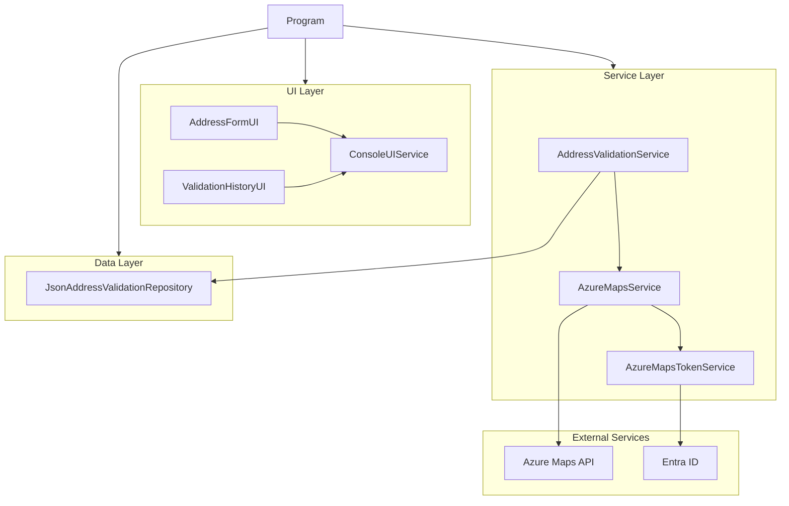

## Architecture

AddressValidator uses a clean, layered architecture with Azure Maps integration:

The application follows clean architecture principles with:
- UI components built with Spectre.Console for rich terminal experiences
- Service layer handling address validation logic and API integration
- Data layer managing validation history persistence
- External integration with Azure Maps secured via Entra ID